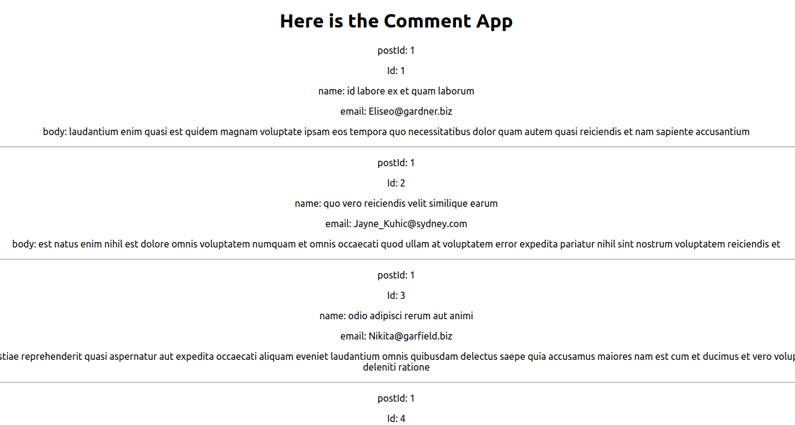

# react-collections-ic

1. Import the JavaScript file holding the test database content.
2. Create a `ToDoCollector` component that will be passed the database content.
3. Inside of the `ToDoCollector`, map each element and return a `ToDo` component that will render the HTML.
4. Inside of the `ToDo` component, return the HTML for each element.

